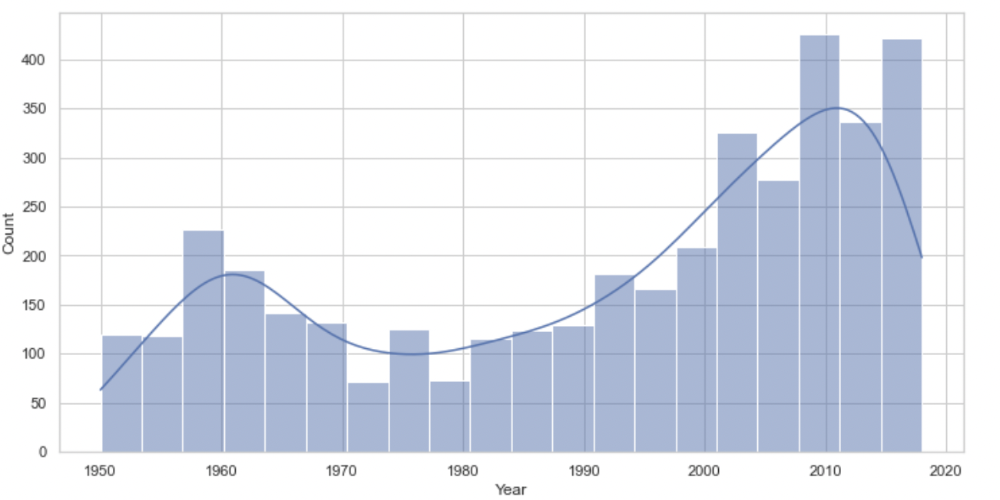
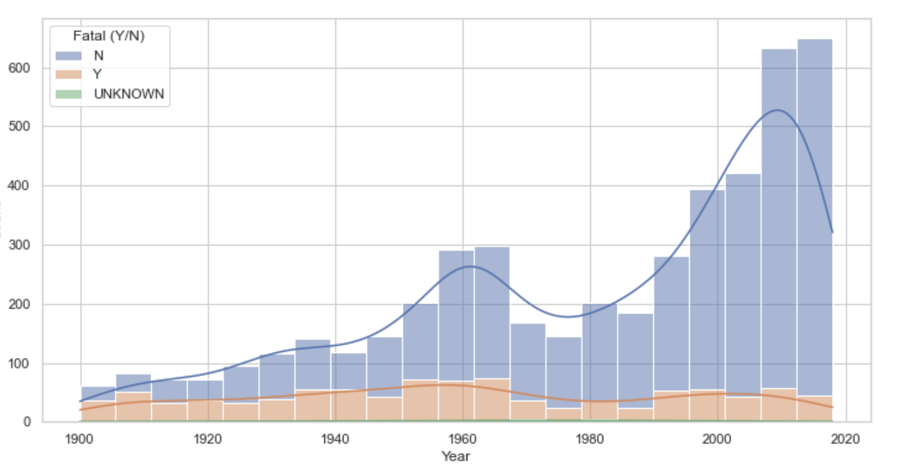
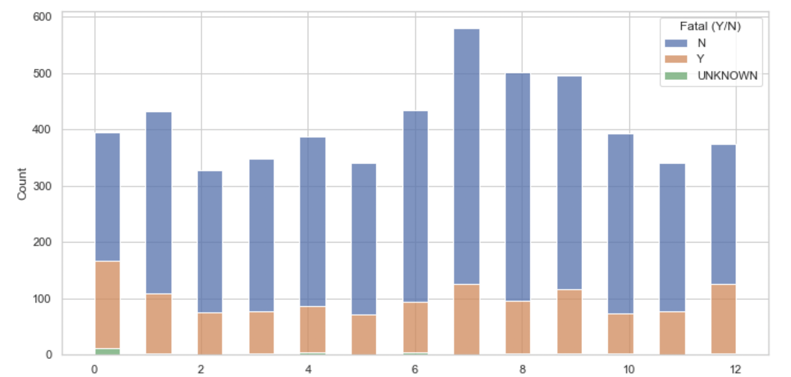
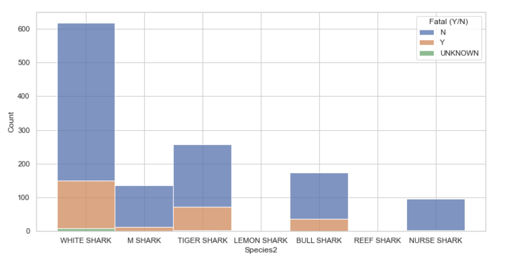
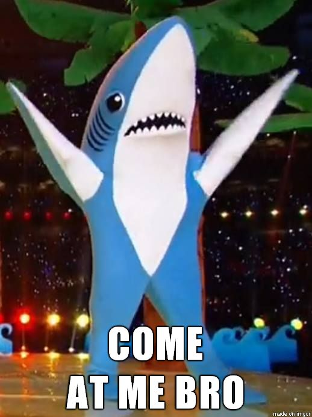

# SHARK ATTACK

## Goals

For this project will be using a Shark attack csv to prove or disprove some hypotesis about shark attacks  
I want to investigate the shark attacks to see if they are that lethal as people think usually if gender or age is realted with shark attacks also check what months are the most dangerous 

## Cleansing

Cleaning proces is contained in the shark juppiter notebook, this proces consist in fixing and standarize the data inside de csv through functions libraries methods to be able later to work with graphics adn confirm our hypothese

## Analysis 

In order to be able to answer the inicial questions mentioned at the beginning of the document we use graphics to help us going through our hypotheses.

### Increase in cases of shark attacks

As we can see in the graph, the cases of shark attacks are increasing. The factors can be many, more people practicing aquatic activities, climate change or an improvement in technology that allows better tracking of cases

### Lethality of shark attacks

As can be seen in the graph, the lethality seems to have  more or less stable line, it is true that the cases have increased a lot in recent years, but the lethality does not seem to have increased. Now a days  precautionns, information and
esponse measures have improved over the years.

### Months with the most cases are when there are holidays?

This question is related to vacations, as can be seen in the graph, the months with the most cases are vacations, especially for the northern hemisphere and now with globalization and easy acces to travel at lower prices people and more people visiting those place higher change to increase the case number.

### Species of shark with more cases

And yes as was expected the king of sharks known by many takes the gold medal White Sharks. As can be seen in the graph, the white shark, by far, is the one with the most cases and the highest lethality but it doesn't even reach 20%.

## Conclusion

Don't be so afraid of sharks, there is more chance of being struck by lightning than being attacked by sharks.
Even if you don't feel safe with these numbers, you can always go to the mountains to get bitten by bugs and snakes or go to the city where you can get hit by a car.

